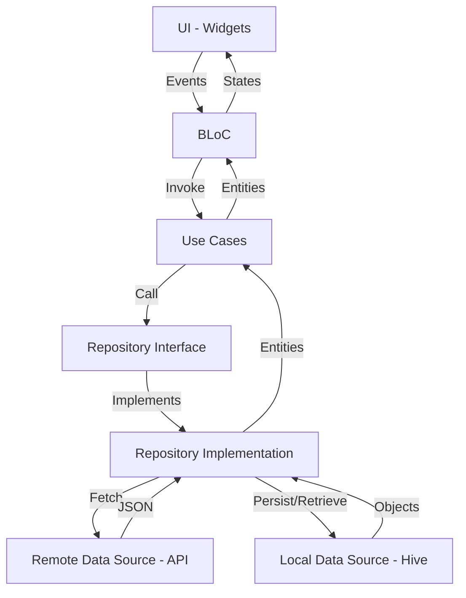

# Design Document - CryptoVault

## Overview
CryptoVault is a mobile application for Android and iOS that provides real-time cryptocurrency price tracking, portfolio management, and historical price charts. The app is built with Flutter, following Clean Architecture principles and using the BLoC (Business Logic Component) pattern for state management. It leverages `freecryptoapi.io` for data and Hive for local storage.

## Goal & Problem Analysis
Users need a reliable, high-performance way to:
1.  **Track Real-time Prices**: Stay updated with the latest market movements for various cryptocurrencies.
2.  **Manage Portfolios**: Record their holdings (assets and amounts) and see the total value in real-time.
3.  **Analyze Historical Data**: View price trends over different periods (24h, 7d, 30d, 1y) to make informed decisions.
4.  **Premium Experience**: Enjoy a modern, accessible UI with support for both light and dark themes (Material 3).

## Alternatives Considered
- **State Management**:
    - *Provider*: Good for simple apps, but BLoC offers better separation of concerns and testability for complex logic.
    - *Riverpod*: A strong alternative, but BLoC is specifically requested and highly suited for event-driven architectures like price tracking.
- **Storage**:
    - *Sqflite*: Robust, but Hive is much faster and easier to use with Dart objects, which is ideal for a responsive mobile app.
- **Architecture**:
    - *MVC/MVVM*: Simpler, but Clean Architecture ensures the domain logic remains independent of external changes (like API or DB updates), making the app more maintainable.

## Detailed Design

### Architecture Layers (Clean Architecture)
1.  **Presentation Layer**:
    - **Widgets**: UI components using Material 3.
    - **BLoCs**: Manage states for "Price Tracking", "Portfolio", and "Charts".
2.  **Domain Layer**:
    - **Entities**: Plain Dart objects like `Coin`, `PortfolioItem`, `HistoricalData`.
    - **Use Cases**: `GetCoinsUseCase`, `UpdatePortfolioUseCase`, `GetHistoricalDataUseCase`.
    - **Repositories (Interfaces)**: Define how the data layer should interact with the domain.
3.  **Data Layer**:
    - **Models**: DTOs for JSON (API) and TypeAdapters (Hive).
    - **Repositories (Implementations)**: Fetch data from remote (API) and local (Hive) sources.
    - **Data Sources**:
        - `RemoteDataSource`: Communicates with `freecryptoapi.io`.
        - `LocalDataSource`: Manages Hive boxes for portfolio data.

### Data Flow (Mermaid)

### Key Components
- **API Client**: Uses `dio` to interact with `https://api.freecryptoapi.com/v1`.
- **Local Database**: Hive boxes for:
    - `settings`: App preferences (theme mode).
    - `portfolio`: User holdings.
- **Charts**: Integration with a charting library (e.g., `fl_chart`) to visualize historical data.

### Theming (Material 3)
- **Seed Color**: `#0D47A1` (Dark Blue) for a professional "fintech" feel.
- **Dark Mode**: High-contrast, premium dark theme with Material 3 surface elevations.
- **Light Mode**: Clean, airy layout with subtle shadows.

## Summary
CryptoVault uses a "feature-first" Clean Architecture structure to ensure scalability. By combining BLoC for reactive state updates and Hive for blazing-fast local storage, the app provides a seamless user experience across both Android and iOS.

## References
- [FreeCryptoAPI Documentation](https://freecryptoapi.com)
- [Clean Architecture + BLoC + Hive Best Practices (2026)](https://medium.com)
- [Material 3 Flutter Guide](https://docs.flutter.dev/ui/design/material)
